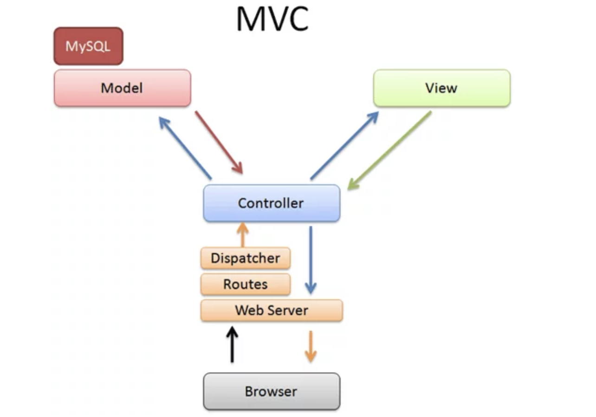

# RUBY ON RAILS DOCS

## Ruby Docs

### Strings in Ruby

- String is a class of Ruby that holds and manipulates an arbitrary sequence of
bytes, typically representing characters.
- Strings are always in single quotes and double quotes

```ruby
address = "this is a string..!"

address_2 = 'string can also be represented in single quotes'

puts address        => This will print out the first string as answer
puts address_2      => This will print out the second string as answer
puts address.class  => this will print out string
```

### Comments:

Single line comments: 

```ruby
# this is a single line comment in Ruby
```

Multi-Line Comment

```ruby
=begin
this is a double line comment or multi line comment in ruby
address = "I will not tell you my address"
=end
```

## String Methods:

| concat | lstrip |
| --- | --- |
| upcase | rstrip |
| downcase | strip |
| capitalize | gsub |
| reverse  | replace |
| delete |  |
| length |  |
| include? | and many more … |

refer: 

[Ruby string class docs-online](https://ruby-doc.org/3.2.0/String.html)

Experiment with all the String Methods

```ruby

first_name = "sridhar"
middle_name = "venkata"

#concat
puts first_name.concat(middle_name) => gives "sridhar venkata"

#upcase

puts first_name.upcase => gives "SRIDHAR"

# change variables
puts first_name.upcase # gave "SRIDHAR"
puts first_name # this will still give us sridhar but to change this also then add !

puts first_name.upcase! # this will make first_name => SRIDHAR

# downcase

puts first_name.downcase => gives "SRIDHAR"

# change variables
puts first_name.downcase # gave "sridhar"
puts first_name # this will still give us sridhar but to change this also then add !

puts first_name.downcase! # this will make first_name => sridhar

# Delete - Deletes the chat or stirng value from the previous string

puts first_name.delete("a") # will give us => sridhr

#Replace - replaces the original string with the new string value

first_name.replace("hello") # this replaces the sridhar in firstname with hello

middle_name.capitalize # prints out the the same string with first letter caps => Venkata

# @reverse - reverse the chars of string 

example_string = "dress"
puts example_string.reverse # this will print out "sserd"

# Length - Counts the number of chars in the string. gives you the length of the string
puts first_name.length

# strip - Remove the white spaces in the both side of thr string
create_var = "Hello.         "
puts create_var.strip   # remove the white spaces to the right of the string 

#lstrip - removes white spaces on the left side of the string

# rstrip - counter part of lstrip

#gsub - substitute the one string with anohter in a string
country = "United Kingdoms"
puts country.gsub!("Kingdom", "States") # if used like this changes the variable
```

Integer classes

- Integer is class of Ruby that holds the integer value or number.
- Integer in Ruby are basically of three types:
    - Fixnum - Numbers less than 2^62
    - Bignum - Numbers greater than or equal to 2^62
    - Whole Numbers - 1,2,3,4….

A Few Methods:

| even? | odd? |
| --- | --- |
| to_s | to_f |

A Few Float Methods :

| abs | round |
| --- | --- |
| to_s | to_i |

```ruby
# Playing around with Number Methods
age = 20
puts age.even?  # returns true as 20 is even

puts age.odd?  # returns false as 20 is even

puts age.to_s    # prints "20" to the console

puts age.to_s.class   # prints string

#abs - returns the absolute value of the floating number

number = -1100.123
puts number
puts number.class    # => float
puts number.abs      # => prints 1100.123
puts number.class    # => prints float

# round - Rounds the floating number to nearest integer valu

grade = 4.5
puts grade.round    # prints 5

points = 5.23456
puts points.round(3) # round off to 3 decimal places
```

### conditional Statements

if-else - conditions

```ruby

# a simple program to reward student with a wish
grade= 3.4 

if grade == 4.0 
		puts "You are awesome student." 
elsif grade >= 3.5 && grade < 4.0 
		puts "You are A grade student" elsif grade >= 3.0 && grade < 3.5 puts "You are average student" elsif grade > 1.5 && grade < 3.0 puts "You need to do better.
else 
		puts "You failed the class."
end
```

switch block or case statements


```ruby
grade = "A"

case(grade) 
		when "A+", "A", "A-" 
				puts "Great Student" 
		when "B+", "B", "B-" 
				puts "Good Student" 
		when "C+", "C", "C-" 
				puts "Poor Student" 
		when "D+", "D", "D-"
				puts "Very Poor Student"
		else
				puts "Failed"
end

```

### String Interpolation

```ruby
no_of_apples = 5

student = "John"

price = 6.99

puts student + 'has' + no of apples.to_s + "Tapples. It cost hin s" + price.to_s
```

### Arrays

```ruby
#Array
student_names = ["John", "David", "Henry","Bob", "Victor"]
student_age = [29, 31, 35, 43, 53)

puts student _names [0]
puts student_names [2]
puts student_names [4]

puts student_age [0] #29
puts student_age [3] #43
puts student_age [4] #53
```

Loops:

- A loop is a sequence of instructions that is continually repeated until a
certain condition is reached.
- Looping is used to iterate over the range of number, text, array elements,
hash elements and so on.

For loop

```ruby
for i in 1..10
		puts "Hello"               # basic syntax of a for loop to execute this statement 9 times
end
```

while loop:

```ruby
x = 10
number = 0

while x >= number do            # if true the inner loop will be executed
		puts "Number is #{x}"
		x -=1
end

```

until loop

```ruby
x = -10
number = 0

until x >= number do            # if false the inner loop will be executed
		puts "Number is #{x}"
		x +=1
end
```

times loop

```ruby
20.times {
		puts "Hello world"
}
```

each loop :

```ruby
countries_array = ["polk", "fairfax", "orange", "dustin"]

for country in countries_array
		puts "Country #{country}"
end

# each loop 
countries_array.each do |country|
		puts "country: #{country}"
end

```

Hashes:

- Hash is a dictionary-like collection consisting of unique keys and their values.
- Hashes are also called Associative Arrays as they are similar to arrays but Hash allows you to use any object type as index instead of integers like array does.

```ruby
# Basic Hash
grades = {"John" => 3.0, "Julie" => 3.9, "Danny" => 3.6}
puts grades["John"]

#iterate over hashes using for loop

for key in grades.keys
		puts key
end

# using each loop
grades.each { |grade|
		puts grade
}

# if values is also required
grades.each { |key, value|
		puts "key #{key} and Value #{value}"
}

```

## Methods:

- Ruby methods are used to bundle one or more repeatable statements into a single unit.
- Ruby methods are very similar to functions in any other programming language.

Example:
    puts 3 + 2 = 5
    puts 4 + 5 = 9
    puts 12 + 12 = 44

```ruby
def add(num1, num2)
		total = num1 + num2
		return total
end

puts add(1,2).  => 3
```

## Classes

- Class is a specification or a blue print (set of instructions) of how to provide some service.
- Like Blueprint, Class has some exact specifications.
- Many Objects can be created from the same class.
- Classes can contain methods, variables for an object.
- A class can have subclasses that can inherit all or some of the characteristics of the class.
- Subclasses can also define their own methods and variables that are not part of their superclass

```ruby
class Dog 
		def name_of_dog (name) 
				puts "I an #(nane]"
		end
		def bark 
				puts "I am barking"
		end
		def eat
				puts "I an eating"
		end
		def sleep 
				puts "I an sLeeping"
		end
		def play
				puts "I an playing"
		end
end

#create an object from the class.
#Classname. new #reate an object called corgi
corgi = Dog.new
corgi.name_of_dog("Jack")
corgi.sleep
corgi.play
```

### Object Oriented Programming:

- OOP - Programming Language Model organized around objects rather than "actions" and data rather than logic.
- Logical procedure that takes input data, processes it, and produces output data.
- In OOP, Everything is an object just like real world.
- OOP Types
    - Encapsulation
    - Inheritance
    - Polymorphis

Encapsulation:

- Process of packing of data and functions into a single component.
- Internal representation of an object hidden from outside.
- Can be used in order to prevent modification of variables from objects.
- Attribute Accessors Types
    - attr_reader: Read Only Access
    - attr_ writer: Write access.
    - attr_ accessor: Read and Write Acces

```ruby
class Student
		attr_reader :cust_id 
		attr_accessor :cust_name, :cust_addr 

		def initialize(id, name, addr)
				@cust_id.= id
				@cust_name = name
				@cust_addr = addr 
		end
end

#create obiect
s1 = Student. new(2741, "George", "593 Baltimore Avenue, Boston MA 02112") 
puts s1.cust_id => "2741"
puts s1. cust_name => "George"
puts s1. cust_addr => "593 Baltimore Avenue, Boston MA 02112"

#Not able to change the id because it is read only
s1.cust_id = 4345

#Can change the name and address
s1.cust_name = "Danny"
s1. cust_addr = "486 Houston Avenue, Chicago, IL 20018"
puts s1.cust_name => "Danny"
puts s1.cust_addr
```

```ruby
class Box
		def initialize(w, h)
				@width = w
				@height = h
		end 

		def display_box_name
				puts "I am box class" end
		end
		#Child class class SmallBox < Box

		def print_area
				@area = @width * @height 
				puts "Area of the smail box is #(earea)"
		end
		def display_price 
				puts "My price is 1200"
		end
end
#BigBox
class BigBox < Box
		def initialize(v,w,h)
				@volume = v
				@width = w
				@height = h
		end
		def print_area
				carea = @width * @height * @volume 
				puts "Big box area is #{@area)" 
		end
end

#Objects
b1 = Box. new (12, 15)
b1.display_box_name   # => "I am box class"
b2 = SmallBox. new (12, 15) 
b2.display_box_name b2.display_price
b2.print_area        # => I am box class => My price is 1200 => Area of the small box is 180

b3 = BigBox. new (40, 24, 30)
 b3. display_box_name
b3.print_area
=begin
=> I am box class
=> Big box area is 28800
=end
```

## Polymorphism

- Polvmorphism derives from the Greek word "Poly" meaning much
or many form or shape.
- Polymorphism in programming refers to the ability to use same
methods in different ways for different objects or data types.


## Intro to MVC ( Model View Controller)

MVC is a way of organizing code for maximum efficiency. It stands for Model, Viewer
Controller



The workflow goes like this :

- The **browser** makes a request, such as `http://mysite.com/video/show/15`
- The **web server** (mongrel, WEBrick, etc.) receives the request. It uses **routes** to find out which controller to use: the default route pattern is `/controller/action/id` as defined in `config/routes.rb`. In our case, it’s the `video` controller, method `show`, with the id parameter set to `15`. The web server then uses the **dispatcher** to create a new controller, call the action and pass the parameters.
- **Controllers** do the work of parsing user requests, data submissions, cookies, sessions and the “browser stuff”. They’re the pointy-haired manager that orders employees around. **The best controller is Dilbert-esque:** It gives orders without knowing (or caring) how it gets done. In our case, the show method in the video controller knows it needs to lookup a video. It asks the model to get video 15, and will eventually display it to the user.
- **Models** are Ruby classes. They talk to the database, store and validate data, perform the business logic and otherwise do the heavy lifting. **They’re the chubby guy in the back room** crunching the numbers. In this case, the model retrieves video 15 from the database.
- **Views** are what the user sees: HTML, CSS, XML, Javascript, JSON. They’re the sales rep putting up flyers and collecting surveys, at the manager’s direction. **Views are merely puppets** reading what the controller gives them. They don’t know what happens in the back room. In our example, the controller gives video 15 to the “show” view. The show view generates the HTML: divs, tables, text, descriptions, footers, etc.

## Routing

The router is the doorman of your application. When an HTTP request arrives from the user’s browser, it needs to know which controller action (method) should be run. The Router is basically just a matching service. It looks at the HTTP verb (GET, POST, PUT, DELETE) and the URL that is being requested and matches it with the appropriate controller action to run. It’s a pretty simple function but an essential one. If it can’t find a route that matches the request, your application will throw an error.

### Root route:

`root "posts#index"`    When we hit the base endpoint of any website what should be displayed to the user ([`http://supercutekittenphotos.com`](http://supercutekittenphotos.com/)  url without any specific route or endpoint) this is the root of any website and we have to set that first.

### RESTful Routes

The can mainly be 7 main actions we can perform on a resource.

1. GET all the posts (aka **“index”** the posts)
2. GET just one specific post (aka **“show”** that post)
3. GET the page that lets you create a new post (aka view the **“new”** post page)
4. POST the data you just filled out for a new post back to the server so it can create that post (aka **“create”** the post)
5. GET the page that lets you edit an existing post (aka view the **“edit”** post page)
6. PUT the data you just filled out to edit the post back to the server so it can actually perform the update (aka **“update”** the post)
7. DELETE one specific post by sending a delete request to the server (aka **“destroy”** the post)

the code that corresponds to each of the line is here
```angular2html
      get "/posts", to: "posts#index"
      get "/posts/:id", to: "posts#show"
      get "/posts/new", to: "posts#new"
      post "/posts", to: "posts#create"  # usually a submitted form
      get "/posts/:id/edit", to: "posts#edit"
      put "/posts/:id", to: "posts#update" # usually a submitted form
      delete "/posts/:id", to: "posts#destroy"
```

Ruby knows we use these methods very often so it has an even shorter way of doing these

```angular2html
    resources :posts
```

just one line and we can assume all the endpoints we’ve set up above can be imagined to be set.

but sometimes we don’t really require writing all the seven routes so we can do this to avoid that

```angular2html
resources :posts, only: [:index, :show]
resources :users, except: [:index]
```

we retrieve the url for a particular route we can do that using
```angular2html
link_to "Edit this post", edit_post_path(3) # don't hardcode 3
```
